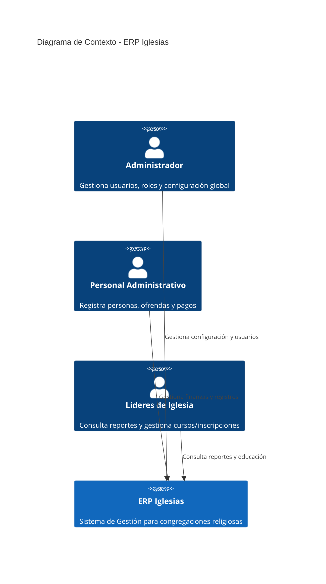
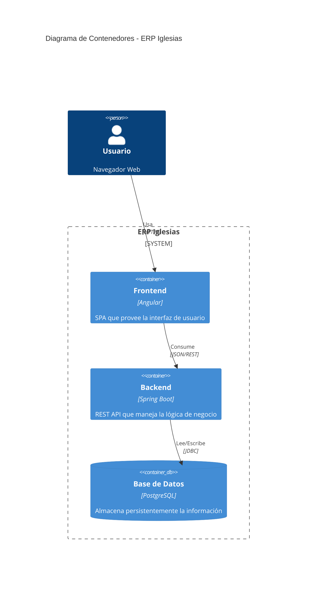
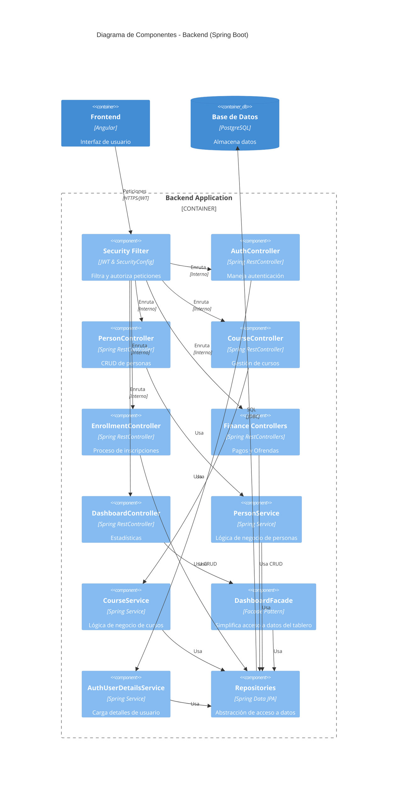

# Documentación de Arquitectura C4 - ERP Iglesias

## 1. Introducción
El proyecto **ERP Iglesias** es un sistema web diseñado para la gestión administrativa y operativa de congregaciones religiosas. La solución está construida sobre una arquitectura moderna y escalable que utiliza las siguientes tecnologías:
- **Frontend:** Angular (SPA)
- **Backend:** Spring Boot (Java)
- **Base de Datos:** PostgreSQL
- **Despliegue:** Docker y Docker Compose

---

## 2. Diagrama de Contexto (Nivel 1)
Este diagrama muestra el sistema ERP Iglesias en su entorno, identificando a los actores principales y su interacción con el sistema como una "caja negra".

**Explicación:**
El sistema centraliza la información para tres tipos de usuarios. Los administradores controlan el acceso, el personal administrativo maneja el flujo financiero y de miembros, y los líderes supervisan las actividades educativas y reportes.

---

## 3. Diagrama de Contenedores (Nivel 2)
Desglosa el sistema en sus contenedores principales, mostrando las tecnologías utilizadas y los flujos de datos.

**Explicación:**
El usuario interactúa con una aplicación de página única (Angular). Esta se comunica mediante peticiones REST con un servidor de aplicaciones (Spring Boot), el cual procesa la lógica y persiste los datos en un motor relacional (PostgreSQL).

---

## 4. Diagrama de Componentes del Backend (Nivel 3)
Muestra la organización interna del contenedor Backend (Spring Boot), detallando la interacción entre controladores, servicios y repositorios.

**Explicación:**
El backend sigue un patrón de capas. La seguridad (JWT) intercepta las peticiones antes de llegar a los **Controladores**. Algunos controladores utilizan **Servicios** para lógica compleja (como `PersonService`), mientras que otros interactúan directamente con los **Repositorios** para operaciones CRUD simples. Los repositorios finalmente se comunican con la base de datos PostgreSQL.

---

## 5. Conclusión
La arquitectura del ERP Iglesias sigue los principios de separación de responsabilidades a través del modelo C4. El uso de contenedores aislados mediante Docker facilita su despliegue y mantenimiento, mientras que la estructura interna del backend asegura un desarrollo organizado y seguro mediante Spring Security y JPA.
